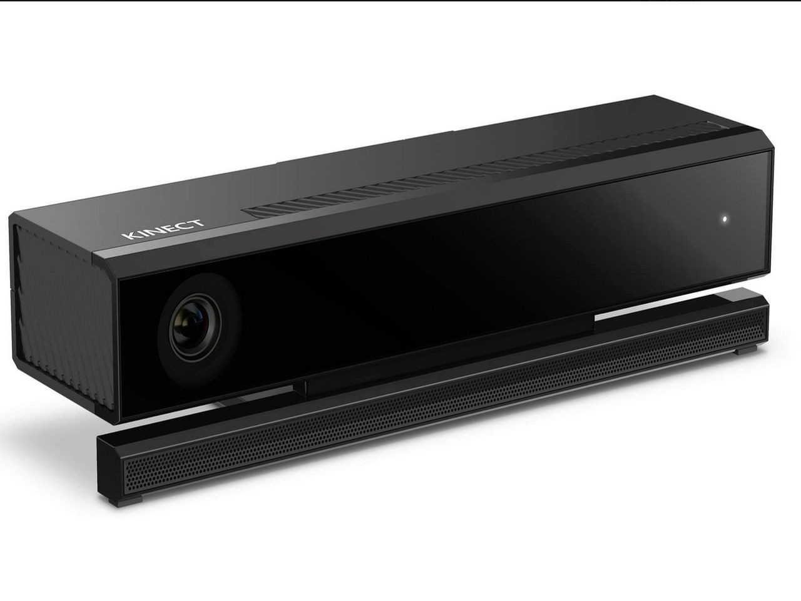

# DUCK HUNT GAME
## Project Done in shrishti 2018

## ABSTRACT 
This is a very famous 90's game which is played with a gun. The overall aim is to shot the flying duck with gun but wouldnt it be cool if you can shot directly with your hand gestures!! 
So, here is the project made for SHRISHTI 2018 in which i used Microseoft KINECT to play the game with hands. 

## SETUP

Install Processing Software & Kinect SDK from internet. Connect kinect to your PC. Let it install the driver automatically. Write your code on Processing and Run It!!!

## REQUIREMENTS
1. Xbox Kinect (Microsoft Product) 
2. Laptop with high graphic quality(at least 4GB graphic card) 
3. Processing software(Open source software) 

## LIBRARIES USED
   Processing has inbuilt libraries for kinect, just download it from internet. Required libraries are:-
    
   . Kinect V2 for Processing - Kinect v2 implementation using the Kinect Windows SDK 
   
   . Kinect4WinSDK - A simple wrapper for the Microsoft Kinect for Windows SDK version 1.8
   
   . Sound - Sound library based on MethCla for Processing
   
   These libraries have inbuilt code examples for detecting body, body depth, body joint coordinates, colour image.
